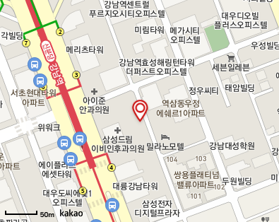
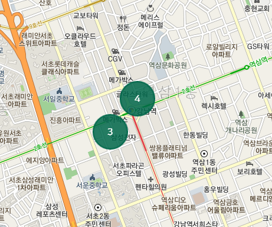
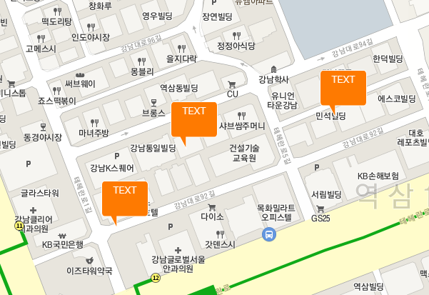
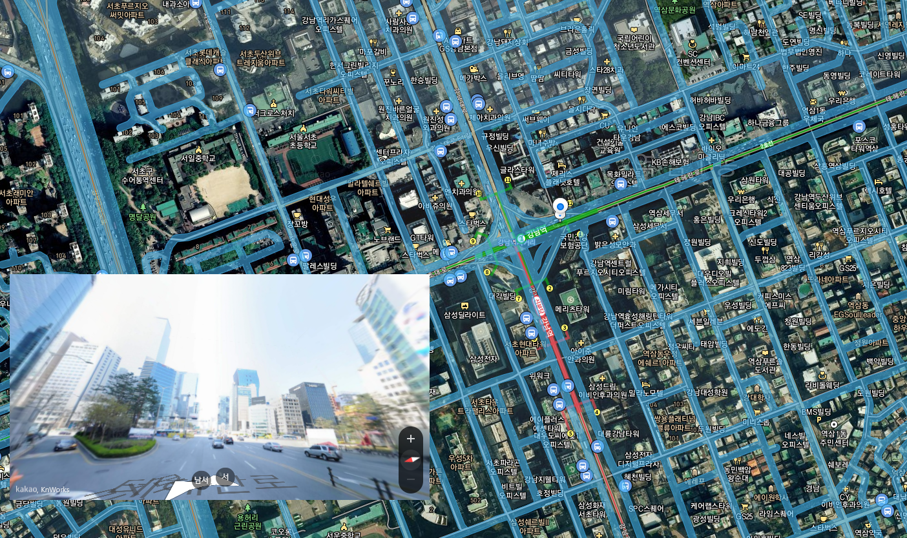
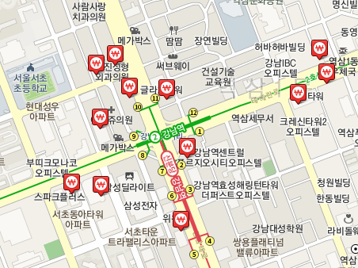

# React_Kakao_Map
React에서 KaKao Map 을 사용하며 정리한 Repository입니다.          

카카오에서 나온 sample들을 참고하였습니다.          
아래 주소에 나온 코드들은 Vanila Script, jQuery여서          
실제 프로젝트에는 React 방식대로 해석하여 코드를 작성하였습니다.           
https://apis.map.kakao.com/web/sample/          

목차
1. 기초세팅 && map 생성
2. 이미지 Marker 생성
3. Marker, Clusterer 동시 생성 및 응용 함수 
4. 커스텀 오버레이 (마커 커스텀 스타일링)
5. 지도 유형 바꾸기
6. 로드뷰 활용
7. 이벤트 추가 및 삭제
8. 카테고리별 장소 검색
9. 줌인&아웃
10. 내 위치

# 기초 세팅 && map 생성
Kakao Map을 사용하기 위해서는 ./public/index.html에 아래 코드를 작성합니다.                

    

map을 적용시킬 div를 생성합니다. useRef를 이용하여 해당 div에 접근합니다.          
map의 경우 지도 유형 등을 바꿀 때 접근해야 하기 때문에 useState로 저장하여           
어디서든 사용할 수 있게 만들었습니다.          
useEffect를 사용하여 로드가 완료되면 카카오 지도를 만듭니다.          

    const [kakaoMap, setKakaoMap] = useState(null);
    const container = useRef();
    .
    .
    .
    // Map
    useEffect(() => {
      const center = new kakao.maps.LatLng( 위도, 경도 )); // 처음 위치를 잡습니다.
      const options = {
      center,
      level: 3  // 처음 줌 거리 낮을수록 줌인
      };

      const map = new kakao.maps.Map(container.current, options);  // container.current -> useRef를 통해 div 에 접근한다.
      setKakaoMap(map); // 생성한 map을 다른 곳에서도 활용할 수 있게 state로 빼줍니다.
    }, [container]);

# 이미지 Marker 생성 (기본적인 Marker 생성법)
샘플 -> https://apis.map.kakao.com/web/sample/basicMarkerImage/         
이미지 마커 생성 법입니다.                
이미지를 설정하지 않으면 기본 마커 이미지가 표시됩니다.             

    // 이미지의 사이즈와 옵셥을 설정합니다.  
    var imageSize = new kakao.maps.Size(35, 44), 
    imageOption = {offset: new kakao.maps.Point(4, 4)}; 
    var markerImage = new kakao.maps.MarkerImage(markerImg, imageSize, imageOption);

    // 마커의 위치를 정합니다.
    var markerPosition  = new kakao.maps.LatLng(37.496463, 127.029358); 
    // 마커를 생성하며 지도에 표시합니다.
    var marker = new kakao.maps.Marker({
        position: markerPosition,
        image: markerImage,
    });
    marker.setMap(map);

# Marker, Clusterer 동시 생성 및 응용 함수 
클러스터러란 지도를 줌아웃 하였을 때 마커의 개수를 표시하는 것입니다.          

클러스터러는 map과 동일하게 여러 곳에서 사용하기 때문에 state로 빼줍니다.          
(excClusterer를 만들지 않은 이유는 따로 이용하는 곳이 없기 때문입니다.)          

    const [, setExcClusterer] = useState();

마커를 담는 배열입니다.

    const [exclusiveArr, setExclusiveArr] = useState([]);

useEffect 등으로 배열에 좌표값을 담습니다.          
(서버에서 정보를 받아옵니다.)          

    setExclusiveArr(
      [ 
        new kakao.maps.LatLng(37.499590, 127.026374),
        new kakao.maps.LatLng(37.499427, 127.027947),
        ...                
      ]
    );

마커와 클러스터를 동시에 생성해 주는 함수를 만들어 코드를 간소화시킵니다.          
마커와 클러스터러는 여러 개 만들 수 있습니다.          
주석으로 추가 설명 이어가겠습니다.          

    const addMarkClust = (array, setClusterer, markerImg, clustererImg) => {

        // 마커가 들어있는 배열의 수가 0이면 만들어지지 않아야하기 때문에 return 시킵니다.
        if(array.length == 0){
            return;
        }

        var imageSize = new kakao.maps.Size(40, 40),
            imageOption = {offset: new kakao.maps.Point(4, 4)};
        var markerImage = new kakao.maps.MarkerImage(markerImg, imageSize, imageOption);

        // 클러스터러는 마커가 배열에 있어야지만 생성되기 때문에 빈 배열을 생성 후 map()을 통하여 push 합니다.
        // 하나의 마커를 토글 시키고 싶을 때는 클러스터러에 담고 토글 기능을 추가하면 됩니다. 
        let markers = [];
        array.map(item => {
            markers.push(
            new kakao.maps.Marker({
                map: kakaoMap, 
                position: new kakao.maps.LatLng(item.Ma, item.La),
                image: markerImage 
            })
            );
        })

        // 클러스터러를 선언합니다.
        var clusterer = new kakao.maps.MarkerClusterer({
            map: kakaoMap,  // 지도는 state로 만든 kakaoMap 을 사용합니다.
            averageCenter: true, // 마커의 중간점을 계산하여 클러스터러를 생성합니다.
            minLevel: 1,  //  최소 level 값을 설정합니다.
            disableClickZoom: true,  // 클러스터러를 클릭 시 자동으로 줌인되는것을 막습니다.
            calculator: [20, 50, 100],  // 마커의 개수별로 클러스터러 스타일을 달리하는데 그 기준을 잡습니다.
            styles:[  // calculator의 배열에 맞게 스타일을 잡습니다.
            {
                width : '50px', height : '50px',
                backgroundImage:  `url(${clustererImg})`, ... 
            { width : '60px', height : '60px', ...},
            { width : '94px', height : '94px', ... }

            ]
        });
        // 클러스터러에 마커를 추가합니다.
        clusterer.addMarkers(markers);

        // 클러스터러를 클릭 하였을 때 클러스터러의 좌표값을 가져옵니다.
        // 해당 기능은 중심 좌표값을 활용하여 주변 건물 좌표를 가져오기 위해 만들었습니다.
        kakao.maps.event.addListener(clusterer, 'clusterclick', function(cluster) {
            setCenterClusterer({
            lat:cluster._center.toLatLng().Ma,
            lng:cluster._center.toLatLng().La
            })
        });

        // 클러스터러를 state로 만들어 외부에서도 접근, 수정 가능하게 만들어줍니다.
        setClusterer(clusterer);
    }

이후 bool 타입 변수에 따라 클러스터/마커를 토글 할 수 있습니다.                   

    bool
    ?
    addMarkClust(exclusiveArr, setExcClusterer, exclusiveMarker, excClusterer) // 마커, 클러스터러 생성
    :
    setExcClusterer(clusterer=>{clusterer.clear(); return clusterer;}); // 마커, 클러스터러 제거

# 커스텀 오버레이 (마커 커스텀 스타일링)
샘플 -> https://apis.map.kakao.com/web/sample/customOverlay1/         
마커에 텍스트를 넣는 등 원하는 데로 스타일링 하고 싶을 때 커스텀 오버레이를 사용합니다.                   
커스텀 오버레이 또한 클러스터러 사용 가능합니다.            

    // 마커대신 들어갈 태그를 넣습니다.
    var content =`
 TEXT 
`;
    // 기본적인 마커를 생성하는것과 유사합니다.
    var customOverlay = new kakao.maps.CustomOverlay({
        position: new kakao.maps.LatLng(item.Ma, item.La),
        content: content,
      });
    markers.push(customOverlay);
    customOverlay.setMap(kakaoMap);

# 지도 유형 바꾸기
샘플 -> https://apis.map.kakao.com/web/sample/changeOverlay1/         
일반, 위성, 지도, 거리 뷰에 대한 코드입니다.         
더 많은 유형은 카카오톡 샘플에 있습니다.         

redux를 활용하여 변수의 값을 변경하였습니다.         
useEffect 안에 switch 문을 이용하여 각각의 이벤트를 주었습니다.         

    // 지도의 타입을 초기화 시킨 후 변수에 따라 재적용 합니다.
    kakaoMap.removeOverlayMapTypeId(kakao.maps.MapTypeId.ROADVIEW);
    kakaoMap.removeOverlayMapTypeId(kakao.maps.MapTypeId.USE_DISTRICT);
    .
    .
    .
    switch (mapRightRedux.mapStyle){
      case "roadmap":
        // 일반지도 입니다.
        kakaoMap.setMapTypeId(kakao.maps.MapTypeId.ROADMAP);    
        break;
      case "district":
        // 지적지도 입니다.
        kakaoMap.addOverlayMapTypeId(kakao.maps.MapTypeId.USE_DISTRICT);
        break;
      case "hybrid":
        // 위성지도 입니다.
        kakaoMap.setMapTypeId(kakao.maps.MapTypeId.HYBRID);    
        break;
      case "roadView":
        // 로드뷰 도로 지도 입니다. ( 로드뷰마커와 로드뷰를 생성하기 위해서는 추가 코드가 필요합니다. )
        // 아래 코드에 대해서는 이벤트 부분에서 자세히 다루겠습니다.
        kakao.maps.event.addListener(kakaoMap, 'click', clickHandler);
        const noRv = document.querySelector(".noRv");
        noRv.addEventListener("click", () => {
          kakao.maps.event.removeListener(kakaoMap, 'click', clickHandler);
          setRoadClusterer(clusterer=>{clusterer.clear(); return clusterer;})
        })
        kakaoMap.addOverlayMapTypeId(kakao.maps.MapTypeId.ROADVIEW);
        break;

      default:
        kakaoMap.setMapTypeId(kakao.maps.MapTypeId.ROADMAP);    
        break;
    }

# 로드뷰 활용
샘플 => https://apis.map.kakao.com/web/sample/basicRoadview2/         

         

로드뷰 도로 지도를 이용하여 로드뷰를 생성하기 위해서는 div를 따로 생성하여야 합니다.         

    <RvWrapper className="rvWrapper">
        <RoadViewDiv className="roadview"></RoadViewDiv>
    </RvWrapper>

그 후 해당 div에 접근하여 로드뷰를 적용시킵니다.         

    // 지도 유형이 roadView 일때만 실행합니다.
    if(mapRightRedux.mapStyle == "roadView"){
      var rvContainer = document.querySelector('.roadview'); //로드뷰를 표시할 div
      var rv = new kakao.maps.Roadview(rvContainer); //로드뷰 객체
      var rvClient = new kakao.maps.RoadviewClient();

      // 로드뷰 마커를 생성합니다.
      var markImage = new kakao.maps.MarkerImage(
        'https://t1.daumcdn.net/localimg/localimages/07/2018/pc/roadview_minimap_wk_2018.png',
        new kakao.maps.Size(26, 46),
        {
            spriteSize: new kakao.maps.Size(1666, 168),
            spriteOrigin: new kakao.maps.Point(705, 114),
            offset: new kakao.maps.Point(13, 46)
        }
      );

      // 로드뷰를 사용하지 않을 때 마커를 없애야 하므로 클러스터러에 담습니다.
      let markers = [];
      var rvMarker = new kakao.maps.Marker({
        image : markImage,
        draggable: true,
        map: kakaoMap,
        position: new kakao.maps.LatLng(37.511138, 126.997544)
      });
      markers.push(rvMarker);
      var clusterer = new kakao.maps.MarkerClusterer({
        map: kakaoMap,
        averageCenter: true, 
        minLevel: 1,
        disableClickZoom: true,
      });
      clusterer.addMarkers(markers);
      setRoadClusterer(clusterer);

      // 로드뷰 도로를 클릭하였을때 사용하는 함수를 정의 합니다.
      var clickHandler = function(mouseEvent) {    
        var position = mouseEvent.latLng; 
        rvMarker.setPosition(position);
        toggleRoadview(position);
      }; 

      // 실제 거리를 보여주는 함수입니다.
      function toggleRoadview(position){
        rvClient.getNearestPanoId(position, 50, function(panoId) {
            // 존재하지 않는곳이라면 보여주지 않습니다.
            if (panoId === null) {
                rvContainer.style.display = 'none';
                rvWrapper.style.pointerEvents  = 'none';
                kakaoMap.relayout();
            } else {
                kakaoMap.relayout();
                rvContainer.style.display = 'block'; 
                rvWrapper.style.pointerEvents  = 'auto';
                rv.setPanoId(panoId, position);
                rv.relayout();
            }
        });
      }
    }

# 이벤트 추가 및 삭제
addListener, removeListener 로  이벤트를 추가/삭제할 수 있습니다.         
    
    kakao.maps.event.addListener(지도, 이벤트타입, 함수);

## (중요) 이벤트 삭제 
이벤트를 삭제할 때는 addListener에서 사용 한 함수를 그대로 사용하여야 합니다.         
또한 같은 위치에 있어야 하며 익명 함수를 사용 시 삭제하지 못합니다.         
( useEffect 또는 함수안에서 addListener를 하였으면 그 안에서 removeListener를 처리하여야 합니다. )         

    case "roadView":
        // click이벤트 시 clickHandler 함수를 호출합니다.   -> 이벤트 추가
        kakao.maps.event.addListener(kakaoMap, 'click', clickHandler);
        const noRv = document.querySelector(".noRv");

        // noRv를 클릭 시 이벤트를 제거합니다.
        // 아래 코드는 외부에서 사용할 수 없습니다.    -> 이벤트 제거 조건 추가
        noRv.addEventListener("click", () => {
          kakao.maps.event.removeListener(kakaoMap, 'click', clickHandler);
          setRoadClusterer(clusterer=>{clusterer.clear(); return clusterer;})
        })
        kakaoMap.addOverlayMapTypeId(kakao.maps.MapTypeId.ROADVIEW);
        break;

# 카테고리별 장소 검색
대형마트, 편의점, 유치원, 지하철 등 여러 시설들의 정보를 받아옵니다.         
샘플 -> https://apis.map.kakao.com/web/sample/categoryFromBounds/         

    // 카테고리 검색을 요청하는 함수입니다
    const searchPlace = () => {
      // 현재 띄어져있는 클러스터러는 제거합니다.
      setAroundClusterer(clusterer=>{if(!clusterer){return;} clusterer.clear(); return clusterer;});
      // 새로운 장소를 검색합니다.
      places.categorySearch(mapRightRedux.around.is, callback, {
        location: new kakao.maps.LatLng(kakaoMap.getCenter().Ma, kakaoMap.getCenter().La)
      });
    }

    // 지도에 idle 이벤트를 추가하고 특정 버튼을 클릭하면 이벤트를 삭제합니다.
    // idle -> 중심 좌표나 확대 수준이 변경되면 발생합니다.
    const aroundBuild = document.querySelector("#aroundBuild");
    kakao.maps.event.addListener(kakaoMap, 'idle', searchPlace);
    aroundBuild.addEventListener("click", () => {
      kakao.maps.event.removeListener(kakaoMap, 'idle', searchPlace);
      setAroundArr([]);
    })

    // 장소 검색 객체를 생성합니다.
    var places = new kakao.maps.services.Places(kakaoMap);

    // 장소검색이 완료됐을 때 호출되는 콜백함수 입니다.
    var callback = function(data, status, pagination) {
      // 정상적으로 검색이 완료됐으면 조건문을 실행합니다.
      if (status === kakao.maps.services.Status.OK) {
        let newArr = [];
        data.map(item => {
          newArr.push(new kakao.maps.LatLng(item.y, item.x));
        })
        setAroundArr(newArr);
      }
    };
    searchPlace()

# 줌인&아웃\
샘플 -> https://apis.map.kakao.com/web/sample/changeLevel/        
줌인, 줌아웃 버튼을 만들 때 사용합니다.         

    // 줌인
    kakaoMap.setLevel(kakaoMap.getLevel() - 1);
    // 줌아웃
    kakaoMap.setLevel(kakaoMap.getLevel() + 1);

# 내 위치
샘플 -> https://apis.map.kakao.com/web/sample/geolocationMarker/        
HTML5 GeoLocation를 이용하여 접속 위치를 얻어옵니다.         
Chrome 브라우저는 https 환경에서만 geolocation을 지원합니다.         

    useEffect(() => {
      // 지도가 없다면 return합니다. 
      if(!kakaoMap){return;}
      // 내위치 토글 조건문 입니다.
      if(mapRightRedux.isCurrnet.is){

        // 마커의 토글을 위하여 클러스터러안에 마커를 담습니다.
        function displayMarker(locPosition) {
          let markers = [];
          var marker = new kakao.maps.Marker({  
              map: kakaoMap, 
              position: locPosition
          });
          markers.push(marker);

          var clusterer = new kakao.maps.MarkerClusterer({
            map: kakaoMap,
            averageCenter: true, 
            minLevel: 1,
            disableClickZoom: true,
          });
          clusterer.addMarkers(markers);
          setCurrnetClusterer(clusterer);
          kakaoMap.setCenter(locPosition);      
        }

        // navigator.geolocation 속성이 있다면 조건문을 실행합니다.
        if (navigator.geolocation) {
          navigator.geolocation.getCurrentPosition(function(position) {
              var lat = position.coords.latitude, // 위도
                  lon = position.coords.longitude; // 경도
              var locPosition = new kakao.maps.LatLng(lat, lon);
              displayMarker(locPosition);
            });
        }else{ 
          // 만약 브라우저가 geolocation 를 지원하지 않는다면 alert를 실행시킵니다.
          alert("navigator.geolocation 지원하지 않음")
        }
      }else{
        setCurrnetClusterer(clusterer=>{ if(!clusterer){return} clusterer.clear(); return clusterer;})
      }
    }, [mapRightRedux.isCurrnet, kakaoMap])

    
